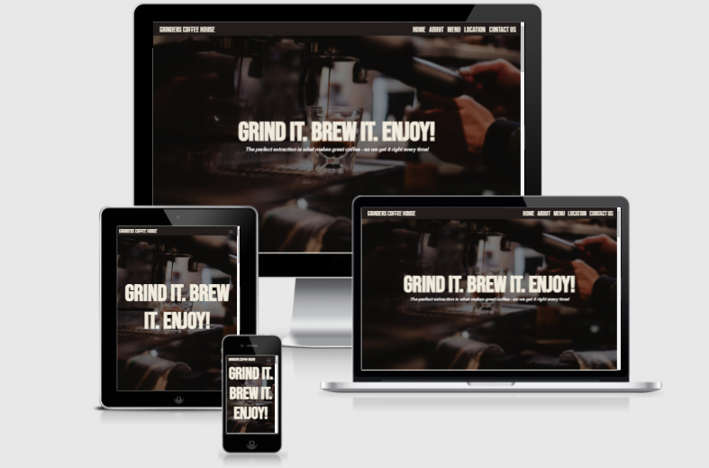

# Grinders Coffee House

[View the live project here.](https://m1key-m.github.io/grinders-coffee-house/)

This is the main marketing website for Grinders Coffee House, an indepentant coffee chain located in the south of England and Cardiff. The website should give users information about the company, its location and products, feedback from existing customers, and ways to contact/connect with the company. 
Also, the website should be responsive and accessible on a range of devices, making it easy to navigate for new and existing customers.

## Contents

1. [User Experience](#user-experience-ux)
2. [Features](#features)
3. [Technologies Used](#technologies-used)
4. [Testing](#testing)
5. [Deployment](#deployment)
6. [Credits](#credits)

## User Experience (UX)

-   ### User stories

- ### As a first-time visitor, I want to...**

    1. Understand the company’s main purpose and find out more about the company’s service offer.
    2. Navigate easily within the site to find relevant content.
    3. Read customer reviews to understand what other customers think of the company and see if they are trusted.
    4. Find the company’s contact details, including social media links, and be able to contact the company easily.

- ### As a returning/frequent visitor, I want to...**

    1. Find the best way to contact the company with any questions I might have.
    2. Find the social media links so that I can join and interact with other customers.
    3. Keep up to date with any menu changes or new locations opening.

-   ### Design
    -   #### Colour Scheme
        -   There are 3 main colors used through out, plain white, an off-white color (#f0ebdd) and a dark brown (#221c1b). I chose a very simple color scheme that was representative of colors associated with coffee. I also chose to keep the color scheme simple to keep everything looking uniform and connected. In doing this it also benefitted accessibilty as the color contrast through out is consistent and all contrast checks passed. There are a few other decorative colors used in the project but none of those had an affect on the contrast score. I have included a color grid to record the scores. [Check the constrast grid here](/testing/testing-images/color-contrast.png)

    #### Typography
    -   The Roboto font is the main font used throughout the whole website with Sans Serif as the fallback font in case for any reason the font isn't being imported into   the site correctly. Robot is a clean font used frequently in programming, so it is both attractive and appropriate. I opted to use the 'Bebas Nue' font for the main headings as it stood out more to me and added a good break from the body font-family, the back up is cursive' and I also used the font-family 'Fredericka the Great' for the menu section as the font resembles the look of chalk which is the look I was aiming for. 

    -   #### Imagery
        -   Imagery is important. The large, background hero image is designed to be striking and catch the user's attention. It also has a modern, energetic aesthetic and is  perfectly linked to the aim of the  website. All other images used throughout the the website are intricately linked to the purpose of the design. 

*   ### Wireframes

    -   Home Page Wireframe - [View](wireframes/desktop.pdf)

    -   Mobile Wireframe - [View](wireframes/tablet.pdf)

    -   Contact Us Page Wireframe - [View](wireframes/mobile.pdf)

    - The final design deviates from the wireframes in some sections quite drastically as during the process of building I felt more compelled to move some sections around as when building, it didn't look as     appealing as it did in my mind. For example, the gallery in the about section has been replaced with a carousel and placed under the text. Also the location section moved more towards the end of the page as it made more sense that way - which was also a much better place to add the reviews. 

## Features

-   Responsive on all device sizes

-   Interactive elements

## Technologies Used

### Languages Used

-   [HTML5](https://en.wikipedia.org/wiki/HTML5)
-   [CSS3](https://en.wikipedia.org/wiki/Cascading_Style_Sheets)

### Frameworks, Libraries & Programs Used

1. [Bootstrap 5.0:](https://getbootstrap.com/docs/5.0/getting-started/introduction/)
    - Bootstrap was used to assist with the responsiveness and styling of the website.
1. [Google Fonts:](https://fonts.google.com/)
    - Google fonts were used to import the 'Roboto' 'Fredericka the Great' and 'Bebas Neu' font into the style.css file which is used on all pages throughout the project.
1. [Font Awesome:](https://fontawesome.com/)
    - Font Awesome was used throughout the website to add icons for aesthetic and UX purposes.
1. [jQuery:](https://jquery.com/)
    - jQuery came with Bootstrap to make the navbar responsive but was also used for the smooth scroll function in JavaScript.
1. [Git](https://git-scm.com/)
    - Git was used for version control by utilizing the Gitpod terminal to commit to Git and Push to GitHub.
1. [GitHub:](https://github.com/)
    - GitHub is used to store the projects code after being pushed from Git.
1. [Balsamiq:](https://balsamiq.com/)
    - Balsamiq was used to create the [wireframes](https://github.com/) during the design process.

## Deployment

### GitHub Pages

The project was deployed to GitHub Pages using the following steps...

1. Log in to GitHub and locate the [GitHub Repository](https://github.com/)
2. At the top of the Repository (not top of page), locate the "Settings" Button on the menu.
    - Alternatively Click [Here](https://raw.githubusercontent.com/) for a GIF demonstrating the process starting from Step 2.
3. Scroll down the Settings page until you locate the "GitHub Pages" Section.
4. Under "Source", click the dropdown called "None" and select "Master Branch".
5. The page will automatically refresh.
6. Scroll back down through the page to locate the now published site [link](https://github.com) in the "GitHub Pages" section.

### Forking the GitHub Repository

By forking the GitHub Repository we make a copy of the original repository on our GitHub account to view and/or make changes without affecting the original repository by using the following steps...

1. Log in to GitHub and locate the [GitHub Repository](https://github.com/)
2. At the top of the Repository (not top of page) just above the "Settings" Button on the menu, locate the "Fork" Button.
3. You should now have a copy of the original repository in your GitHub account.

## Credits

### Code

-   The full-screen hero image code came from this [Unsplashed] credit to Jason Betz (https://www.instagram.com/jasonbetz/)

-   [Bootstrap5](https://getbootstrap.com/docs/5.0/getting-started/introduction/): Bootstrap Library used throughout the project mainly to make site responsive using the Bootstrap Grid System.

### Content

-   All content was written by the developer.

### Media

-   All Images were sourced from [Unsplash] (https://www.unsplash.com) or [Pexels] (https://www.pexels.com/)

### Credits for individual images 
#### Names of iamges are what the files are called in the HTML
 -  Hero image: credit to Jason Betz (https://www.instagram.com/jasonbetz)
 -  Gallery1: credit to (https://www.louishansel.com)
 -  Gallery2: credit to (https://www.pexels.com/@jayoke)
 -  Gallery3: credit to (https://www.instagram.com/helena_wlt)
 -  Gallery4: credit to (https://www.instagram.com/marty_dzed)
 -  Gallery5: credit to (https://www.instagram.com/andreapiacquadio_)
 -  Gallery6: credit to (https://www.instagram.com/orlovamaria/)
 -  Location-one: credit to (https://www.instagram.com/heftiba.co.uk)
 -  Location-two: credit to (https://unsplash.com/@cyzx)
 -  Location-three: credit to ( https://www.instagram.com/Lilybanse)

 #### Other resources used for images are:
-   Image compressor ( http://tinypng.com/)
-   Image converter (https://ezgif.com/png-to-webp)

### Acknowledgements

-   My Mentor for continuous helpful feedback.

